## 🐢  Game Preview

**What on Earth** 는 환경에 대한 교훈을 주는 2D 탑-다운 뷰 게임입니다.

귀여운 동물들은 잘못이 없는데… 귀여운 동물과 미니게임을 플레이하다보면, 우리의 일상 속 환경에 무심했던 행동들의 영향을 되돌아보고 환경문제에 대한 경각심을 유도할 수 있는 게임입니다.

총 3개의 맵으로 이루어져 맵별로 각각의 미니게임을 진행하고 환경에 대한 메세지를 전합니다.

## 🐢  Team and TeamWork

안세혁

[shyukahn - Overview](https://github.com/shyukahn)

주서현

[seohyj - Overview](https://github.com/seohyj)

## 🐢  개발 환경

- Game Engine: Unity
- Language: C#
- Design: Figma, Runwayml

## 🐢  What on Earth - 플레이 소개

- **What on Earth**는 메인화면, How to Play 화면, 그리고 3개의 맵으로 구성되어 있습니다.
- 각 장면별로 풍부한 경험을 위해 사운드와 함께 즐겨보세요!
- ~~스포 방지를 위해 주요 장면 캡쳐만 넣어둡니다~~

### Main Scene

- 게임 시작, How To Play, 게임 종료 버튼으로 구성

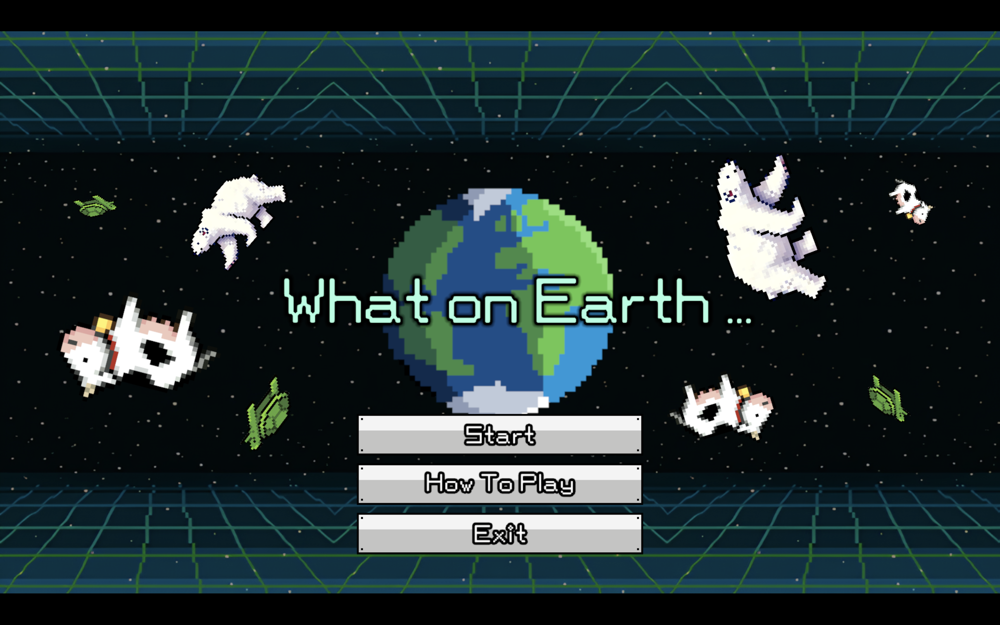

### How To Play Scene

- 간단하게 조작방법을 설명하는 단계

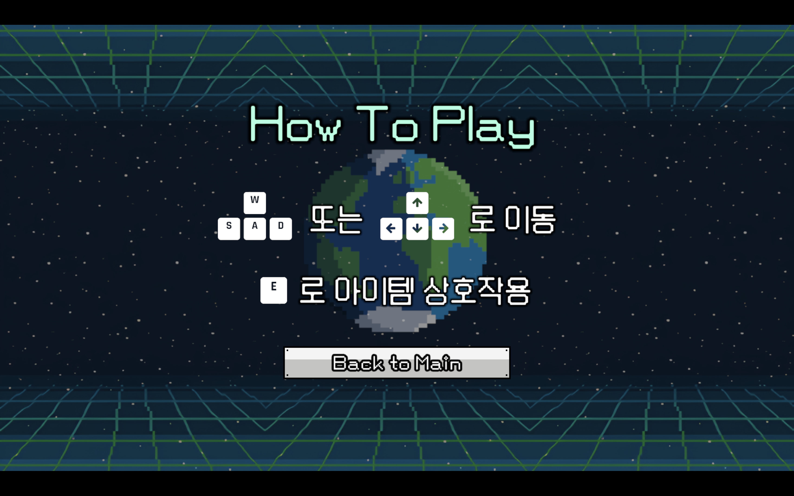

### 3개의 동물 Scene

- 거북이, 북극곰, 소에 대한 게임을 선택하는 화면
- 동물들이 버튼으로 작동하여 각각 동물에 대한 맵으로 이동 가능

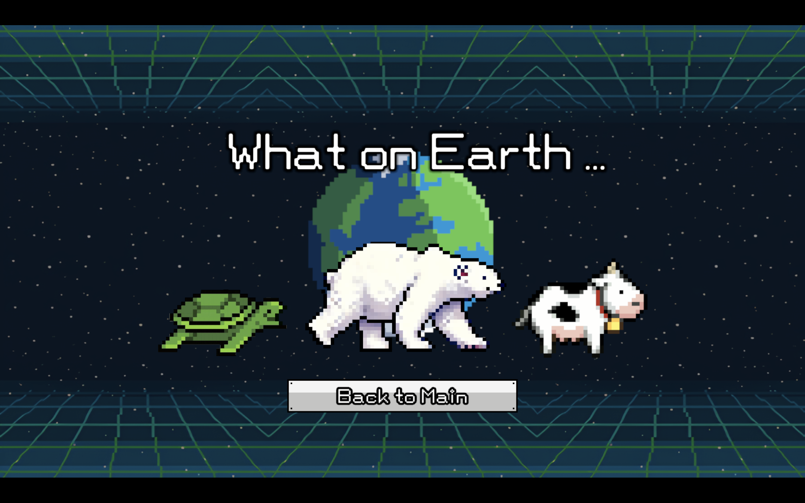

### 거북이 맵

- 두 개의 스테이지로 구성
- 거북이 먹이 아이템을 모두 찾는 미니게임
- 먹이 아이템을 다 찾으면 엔딩 화면으로 이동

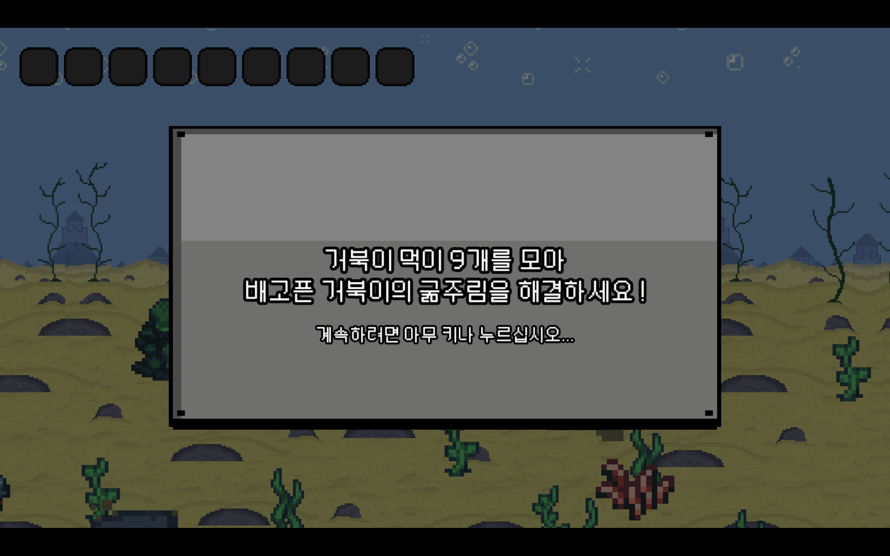

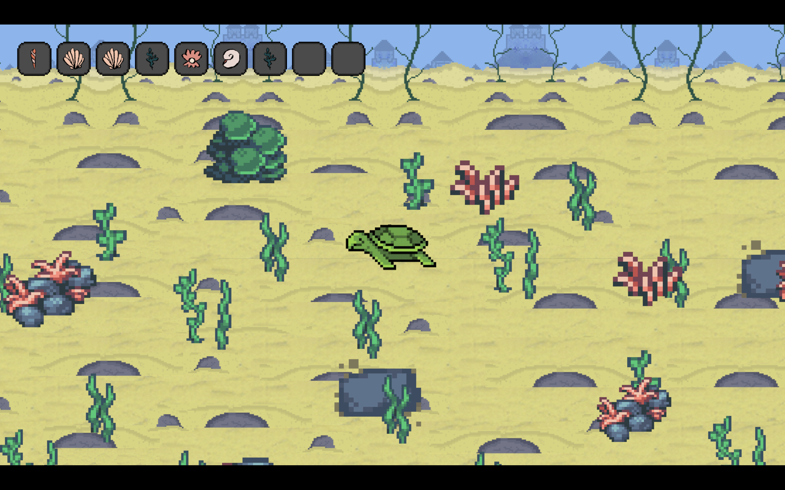

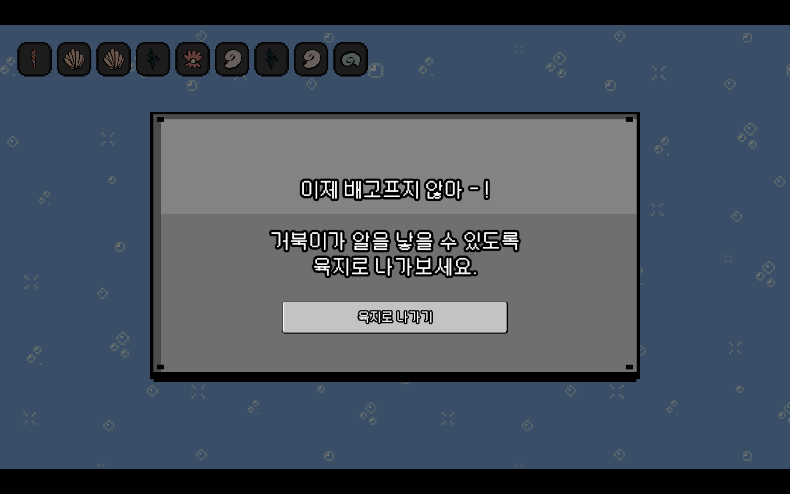

### 북극곰 맵

- 집에 사는 사람이 에어컨 부품을 모두 찾아 조립하는 미니 게임
- 모두 모아 성공하면 북극곰에 대한 엔딩 장면으로 이동

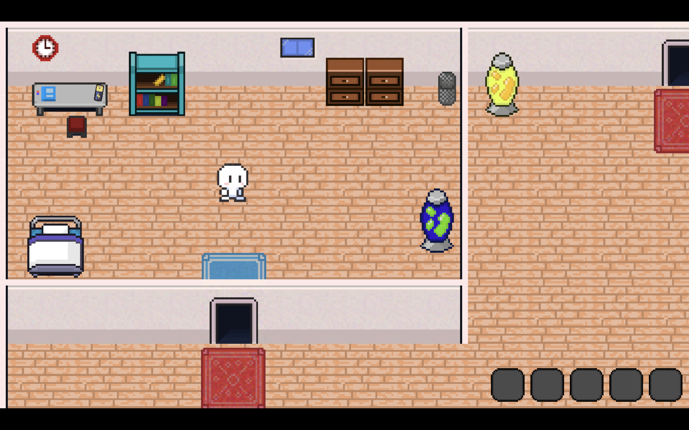

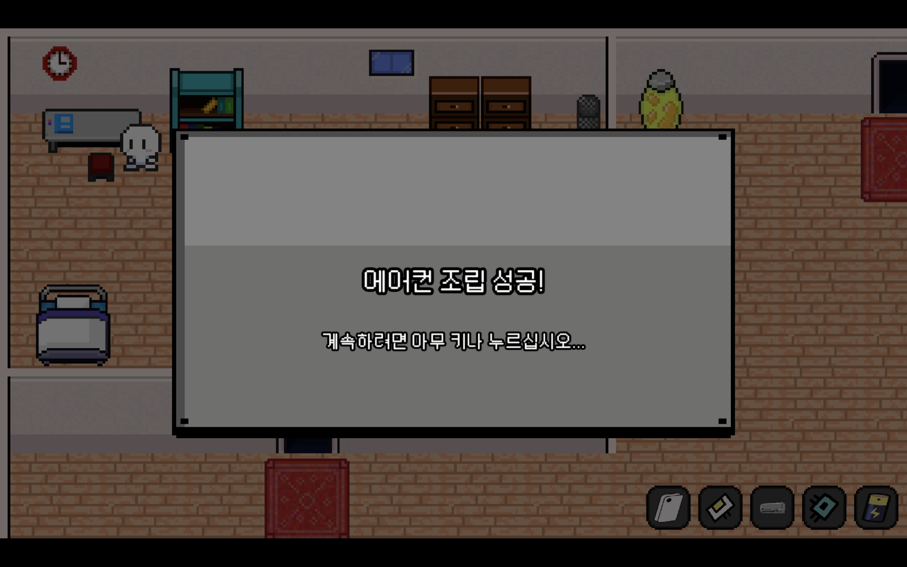

### 소 맵

- 소가 먹이를 먹도록 조종하여 수익을 올리는 미니게임
- 각 먹이마다 랜덤 사진과 랜덤 비용이 할당됨
- 맵의 랜덤 위치에 나오는 먹이를 먹고 총 수익 $100을 달성하면 엔딩 장면으로 이동

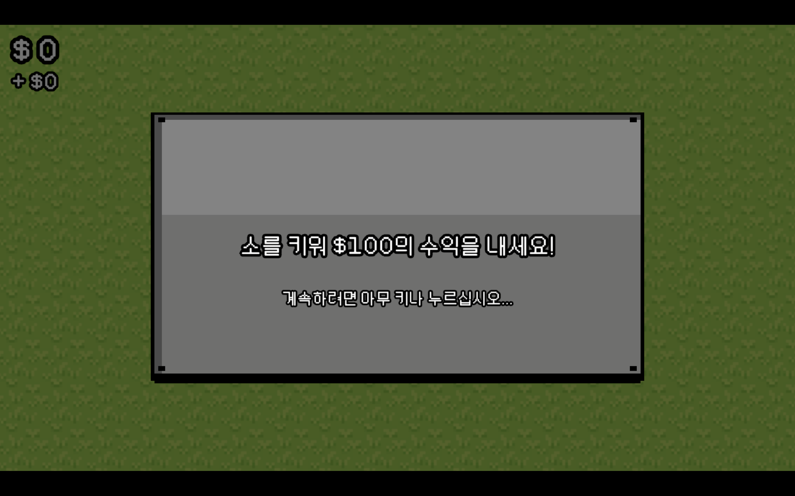

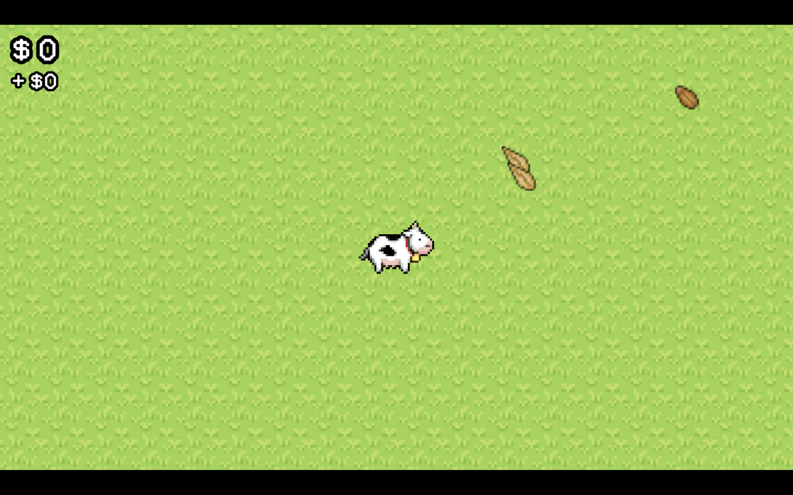

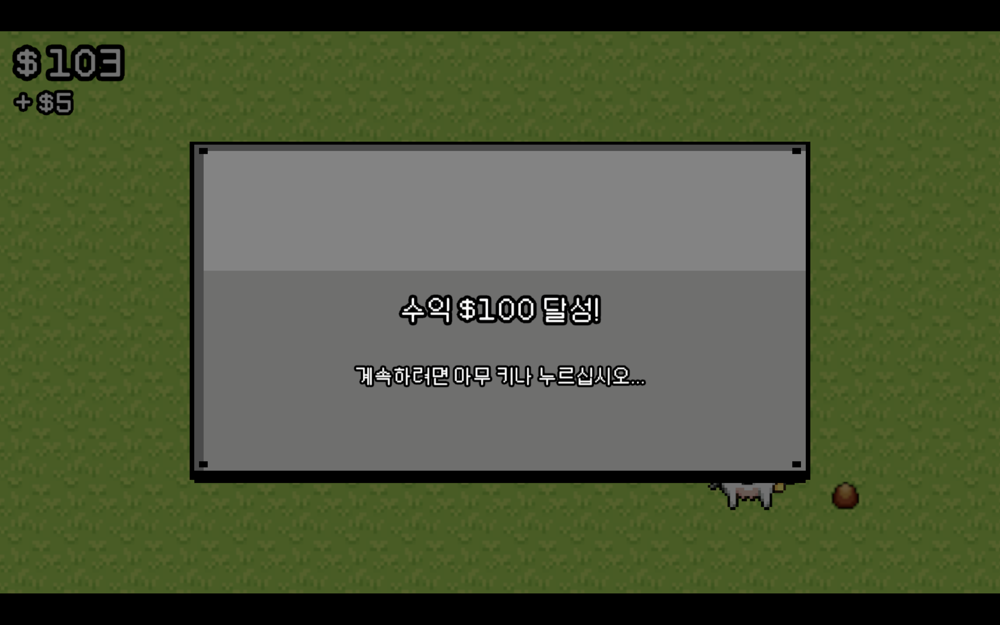

## 🐢  What on Earth - Game Features

### 애니메이션

- 각 맵의 캐릭터마다 Idle 상태와 Run 상태마다 애니메이션 구현
- 플레이어가 움직이는 상태에 따라 애니메이션이 바로 전환되도록 구현

### 음향 효과

- 캐릭터가 움직일 때 각 맵의 상황에 따라 발걸음 소리가 나도록 구현
- 각 맵에서 아이템을 먹을 때마다 소리 효과가 나타나도록 구현

### 사용한 Asset 모음

- 사용한 에셋 펼쳐보기
    
    https://assetstore.unity.com/packages/2d/characters/simple-2d-platformer-assets-pack-188518
    
    https://assetstore.unity.com/packages/2d/2d-basic-room-assets-234762
    
    https://assetstore.unity.com/packages/2d/gui/icons/simple-free-pixel-art-styled-ui-pack-165012
    
    https://assetstore.unity.com/packages/audio/sound-fx/free-casual-game-sfx-pack-54116
    
    https://assetstore.unity.com/packages/audio/sound-fx/foley/footsteps-essentials-189879
    
    https://assetstore.unity.com/packages/audio/music/casual-game-bgm-5-135943
    
    https://assetstore.unity.com/packages/2d/gui/icons/game-input-controller-icons-free-285953
    
    https://assetstore.unity.com/packages/audio/music/orchestral/free-piano-loops-platypus-patrol-29221
    
    https://assetstore.unity.com/packages/audio/music/arcade-game-bgm-17-210775
    
    https://opengameart.org/content/2d-cereals
    
    https://opengameart.org/content/16x16-rpg-tileset
    

## 🐢  게임 빌드 파일

- Unity의 Sound Asset 및 Loyalty-Free 음악 사용

파일을 다운받아 플레이해보세요!

- **Windows**

[What_on_Earth_windows.zip](https://drive.google.com/file/d/1tWJz4-g3Z87_Y3q-rieDIyMihXpu94sJ/view?usp=sharing)

- **MacOS**

[WhatOnEarth.zip](https://drive.google.com/file/d/1zpjiObEsqzBY2k3NtoWPcCmkiTJehpTx/view?usp=sharing)
